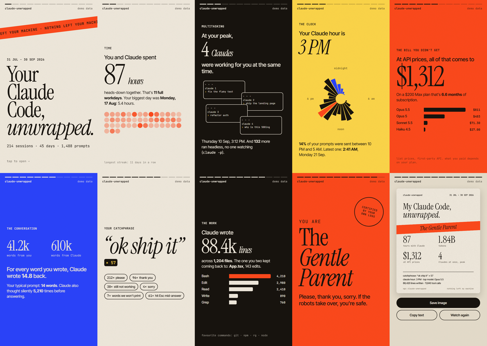
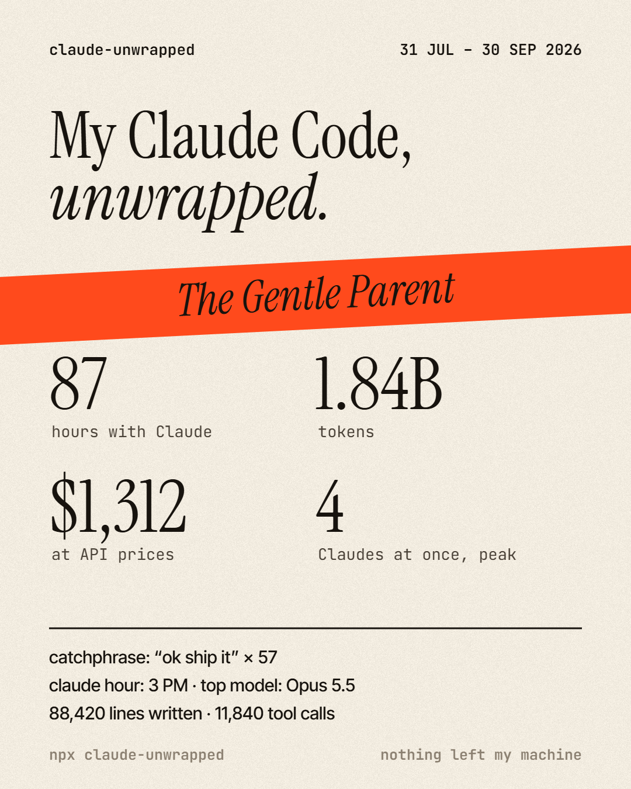

# claude-unwrapped

**Your Claude Code history, told as a story you can tap through.**

```sh
npx claude-unwrapped
```

Claude Code already keeps a log of every session in `~/.claude/projects`. This reads those logs
and turns them into a Wrapped-style story: the hours, the tokens, the bill you didn't get, how many
Claudes you had running at once, the thing you kept typing, and what kind of Claude user that makes
you. It runs on your machine and opens one HTML file. Nothing is uploaded.



## What it found on mine

- **64 hours** of actual time with Claude over the last ~2.5 months. That's wall-clock: three
  sessions open at once count once.
- **At my peak, 6 Claudes were working at the same time**, and another **764 runs** happened
  headless (`claude -p` from my own scripts) with nobody watching.
- **2.6 billion tokens, 97% of them cache reads.** Claude re-reading context it already had.
- **$2,004 at API list prices.** I'm on a subscription, so that's the bill I didn't get.
- My catchphrase is **"go on"**. Twenty times.
- Verdict: **The Conductor**. *"You don't pair with Claude. You run an orchestra of them."* Fair.

## What you get

A 9:16 story (tap or arrow keys; hold to pause), and at the end a share card you can save as a
PNG, with a copy-paste caption:



| Slide | What it shows |
|---|---|
| **Time** | Hours with Claude, your biggest day, a dot per day, your longest streak |
| **Multitasking** | The most Claudes you had running at once, plus headless `claude -p` runs |
| **The clock** | Your prompts on a 24-hour clock, your Claude hour, your latest night |
| **Tokens** | Total tokens, in *War and Peace* copies, and how much was cache |
| **The bill you didn't get** | What it would have cost at API list prices, per model |
| **The conversation** | Your words vs Claude's, your typical prompt length |
| **Your catchphrase** | The short thing you typed most, plus the pleases, thank-yous and "still not working"s |
| **The work** | Lines Claude wrote, files touched, the file you kept coming back to, top tools |
| **Where it went** | Which projects the edits landed in |
| **You are…** | One of seven archetypes, picked from your numbers |

And the short version in your terminal:

```
  claude-unwrapped  79 days, 125 sessions

  64 hours with Claude   2.6B tokens   $2,004 at API prices
  6 Claudes at once, at peak   (+764 headless runs)
  catchphrase: "go on" x20

  You are The Conductor.
```

## Options

```
npx claude-unwrapped              everything on disk
npx claude-unwrapped --days 30    just the last 30 days
npx claude-unwrapped --private    hide project and file names (use this before you post)
npx claude-unwrapped --demo       a made-up story, no logs needed
npx claude-unwrapped --json       the raw numbers
npx claude-unwrapped --dir ~/.claude-work --dir ~/.claude
                                  more than one config folder (if you switch accounts)
```

`$CLAUDE_CONFIG_DIR` is picked up automatically.

## How the numbers are counted

The log format is undocumented, so here is exactly what it does:

- **Tokens** come from the `usage` block on each assistant message. One API message is written as
  several log lines (one per content block), each repeating the same usage, so usage is counted
  **once per message id**. Counting lines instead more than doubles the total (2.2× on my logs).
- **Hours** are stretches of activity per session, where a gap over 15 minutes ends the stretch,
  merged across sessions so parallel ones don't double count. The difference between the sum and
  the union is where the "Claudes at once" number comes from.
- **Headless runs** are sessions logged with an `sdk-*` entrypoint (`claude -p`, the Agent SDK).
  Their tokens count; their prompts don't count as yours.
- **Prompts** are what you typed. Slash commands, tool results, interrupts, subagent traffic and
  injected context are excluded.
- **Cost** uses Anthropic's first-party list prices per model, with cache writes at 1.25× (5 min) or
  2× (1 hour) input and cache reads at each model's rate. It's what the same tokens would cost on
  the API, not what you paid.
- **Projects** are found by walking up from each edited file to the nearest folder with a `.git`,
  `package.json`, `pyproject.toml` and so on. Starting Claude from a folder of projects still gives
  you the real project names.
- **Your catchphrase** has to repeat at least 3 times, be under 28 characters, and contain only
  letters, so a path, a key or a number never ends up on the card.

Claude Code deletes old transcripts after 30 days by default (`cleanupPeriodDays` in
`settings.json`), so the story covers what's still on disk.

## Privacy

It reads files under your Claude config folder and writes one HTML file to your temp folder. It
makes no network requests. The page itself loads its fonts from Google Fonts; your data is inlined
into the file and never sent anywhere. Your prompt text never goes into the page, apart from the
catchphrase.

Project names and your most edited file do appear in the local story. `--private` removes them. The
share card never shows them either way.

## Requirements

Node 18 or newer. No dependencies.

```sh
git clone https://github.com/himanshuSri24/claude-unwrapped
cd claude-unwrapped
node bin/claude-unwrapped.mjs --demo
npm test
```

Not affiliated with Anthropic. Claude and Claude Code are Anthropic's.

If this made you laugh at your own "still not working" count, [a coffee](https://buymeacoffee.com/devwithcoffee) keeps
the next one coming.

MIT © Himanshu Srivastava
